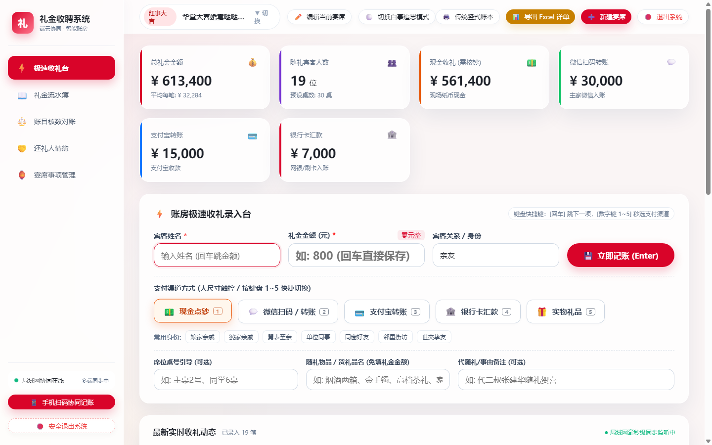
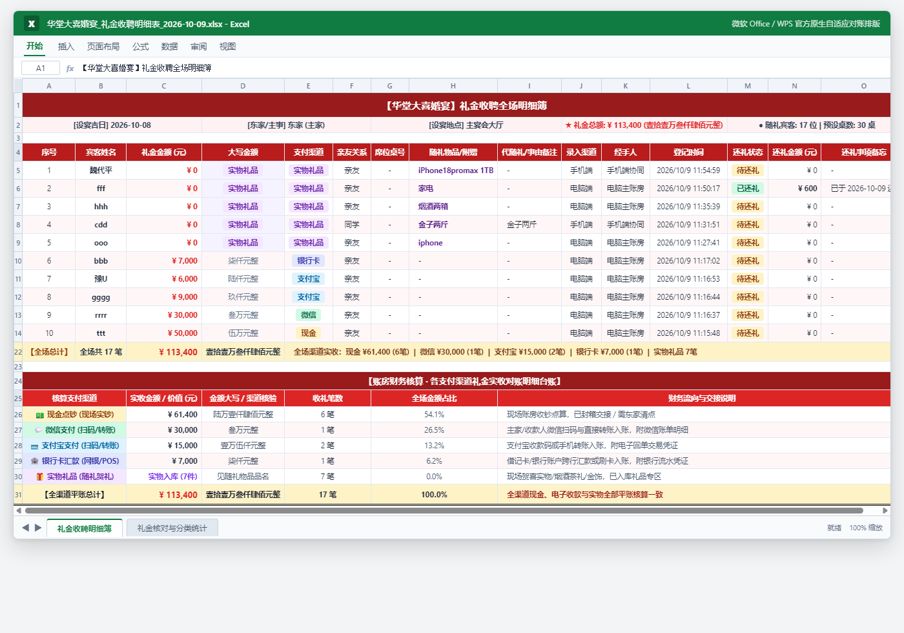
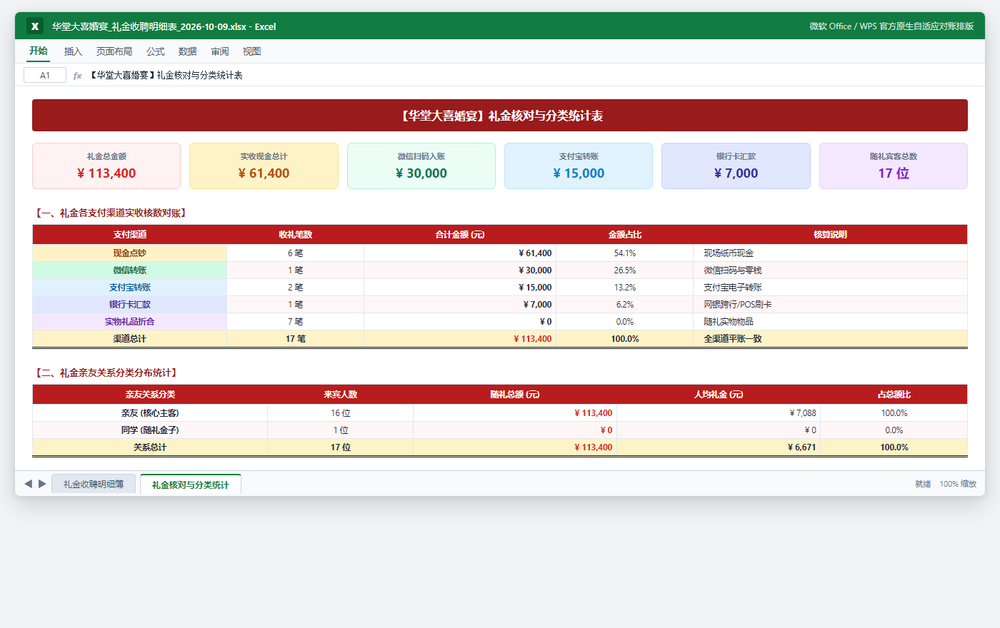
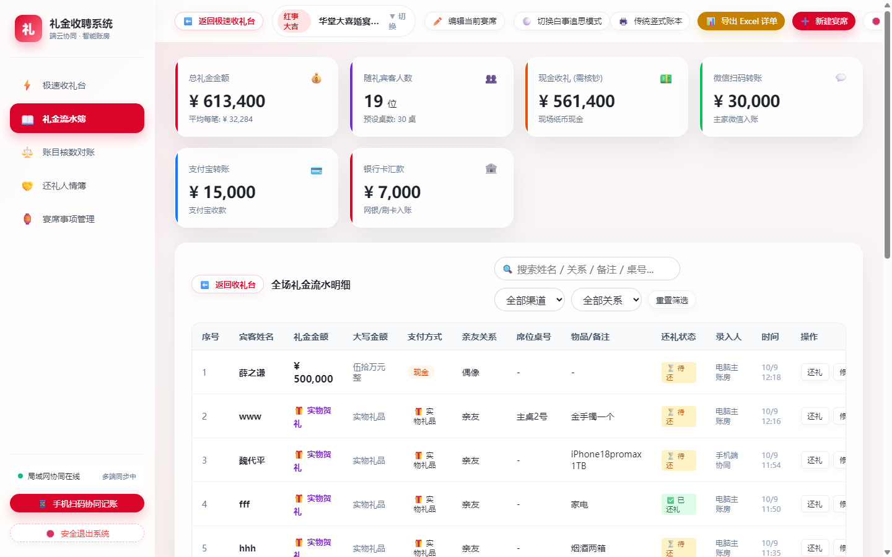
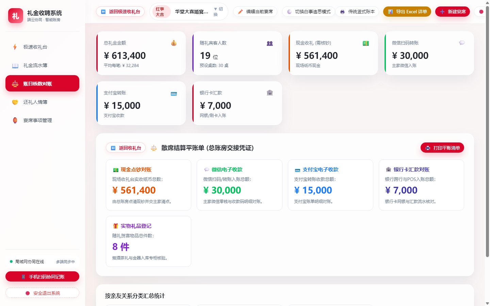
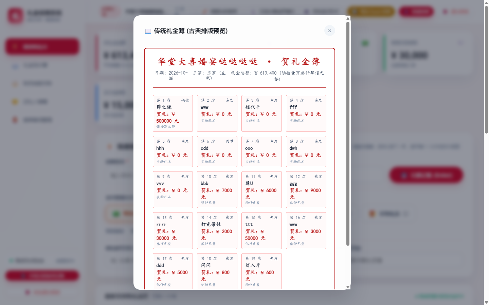
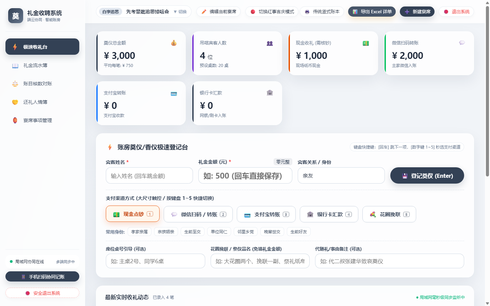

# 🏮 礼金收聘系统 · 账房云枢 (Banquet Gift Cashier)

> **专为民间宴席红白喜事现场打造的高性能、纯本地离线、局域网多端协同记账系统**  
> 传承自「智汇云枢网盘」毛玻璃微质感与工程级高可靠性架构，支持任意电脑一键部署、跨设备扫码协同与终身人情往来对账。

---

## 📸 系统全景视觉展示 (界面与导出效果预览)

> **本工程已内置全套高定视觉体系：支持电脑总账房主控、手机端免装 App 扫码协同、传统古典竖式礼金簿，以及官方标准双工作表 Microsoft Excel 自适应排版导出与自动平账。**

### 1. 💻 电脑端 · 极速收礼台与总账房主控台 (红事喜庆模式)
* **核心亮点**：沉浸式毛玻璃高贵典雅红金质感、四大核心财务指标卡（总额/人数/现金核钞/电子入账）、左侧全键盘盲打流转录入（支持 1~5 键秒切支付方式、大写金额自动校验）、右侧实时流水账簿与操作。


### 2. 📊 导出 Excel 专业详单效果 · Sheet 1《礼金收聘全场明细簿》
* **核心亮点**：
  * **智能列宽自适应**：基于字符视觉字模动态计算最长项宽度并预留安全边距，打开表格直接通览全貌，绝不遮挡截断；
  * **实物礼品规范标注**：第 4 列大写金额规范显示高亮「实物礼品」，第 8 列独立展示具体品名（如 `iPhone18promax  1TB`、`金子两斤`、`烟酒两箱`），文字带缩进彻底消除贴边遮挡；
  * **底部各渠道平账台账**：实收金额严格垂直对准主表第 3 列，金额大写对准第 4 列，全渠道平账占比准确无误显示为 **`100.0%`**。


### 3. 📈 导出 Excel 专业详单效果 · Sheet 2《礼金核对与分类统计》
* **核心亮点**：
  * **6 大独立高颜值指标卡**（礼金总额、现金、微信、支付宝、银行卡、来宾总人数）；
  * **各支付渠道实收核数表**（笔数、合计金额、金额占比、核算说明清晰平账）；
  * **亲友关系分类分布与人均礼金表**（按核心主客、世交、同学分类统计随礼总额与人均礼金）。


### 4. 📱 手机端 · 现场迎宾移动扫码协同 (免装 App 即扫即用)
* **核心亮点**：现场迎宾、伴郎或主家直接微信扫码秒开；单手触控优化大字号金额输入、亲友关系快捷标签、三项结构化输入框（席位桌号引导、随礼物品贺礼品名、代随礼事由备注）；支持局域网毫秒级 SSE 实时双向广播。
<div align="center">
  
</div>

### 5. 📖 电脑端 · 礼金流水明细簿与全场往来检索
* **核心亮点**：支持按宾客姓名、亲友关系、席位桌号实时拼音/模糊全文检索；还礼状态可视化胶囊标记；单笔流水秒级修改与红字作废。


### 6. ⚖️ 电脑端 · 账目核数对账与多渠道平账中心
* **核心亮点**：实时计算全场现金实钞总额（用于账房与东家点钞交接），微信、支付宝电子账户账单对账，全渠道差额自动平账检验。


### 7. 📜 古典大红竖式礼金簿 · 现场打印与档案存照
* **核心亮点**：一键生成传统民间竖式红格礼金簿，古法雅致排版，支持直连打印机现场打印或保存为 PDF 永留纪念。


### 8. 🕊️ 电脑端 · 白事追思奠仪模式 (专仪专用 · 风格彻底物理隔离)
* **核心亮点**：水墨素雅黑黛质感，文案自动切换为“奠仪香仪明细簿”、“花圈挽联祭仪登记”，屏蔽所有吉庆喜庆色彩，肃穆庄重。


---

## 🌟 核心特性与架构亮点

### 1. 纯本地物理隔离 · 零云端依赖
* **100% 本地安全持久化**：所有宴席数据存放于本地 `data/lijin_database.json`，绝不上报任何外部云端服务器，完全保障亲朋隐私。
* **写队列原子落盘与自愈灾备**：采用内存异步顺序写队列消除并发竞态冲突，原子重命名防断电文件损坏，后台滚动留存最近 30 份灾备快照。
* **独立宴席数据强物理隔离**：每场宴席拥有全局独立编号（`eventId`），账目、流水、对账与 Excel 导出物理切分，换席互不混淆。

### 2. 红白喜事双模沉浸 · 专仪专用
* 🔴 **红事吉庆模式**：典雅喜庆红与香槟金微质感，支持新婚大喜、满月庆典、乔迁志庆、寿诞华宴。随礼项目为“🎁 实物贺礼”，免填现金金额。
* ⚪ **白事追思模式**：肃穆素雅玄石灰蓝与水墨质感，治丧奠仪、追思悼唁。随礼项目切换为“💐 花圈挽联”，自动屏蔽喜庆动效。

### 3. 极速盲打与人机工效设计 (总账房主控台)
* **纯小键盘流畅流转**：支持键盘 `姓名` $\to$ `[Enter]` $\to$ `金额` $\to$ `[Enter]` $\to$ 秒级完成单笔录入并自动聚焦下一位。
* **自动金额大写校验**：数字金额实时动态翻译为中文大写（如：`800` $\to$ `捌佰元整`），杜绝人多杂乱时看错漏位。
* **键盘 1~5 快捷切换支付方式**：1-现金点钞、2-微信扫码、3-支付宝、4-银行汇款、5-实物折合。
* **全站沉浸式页面内弹窗**：杜绝原生浏览器弹出阻断，支持 ESC 键与背景快速关闭，保证现场 60FPS 极速响应。

### 4. 手机扫码局域网协同 (现场迎宾利器)
* **免装 App 秒开协同**：电脑端一键出示高清二维码，迎宾分台、伴郎或主家直接用微信或手机浏览器扫码即开。
* **毫秒级 SSE 局域网广播**：手机端录入后，电脑主台大屏幕秒级自动刷新并发出提示音；主台切换宴席，所有手机自动同频切换。
* **无外网离线顺畅运行**：即便宴会厅地下室完全无宽带或手机信号，电脑开启“Win10/11 移动热点”，手机连上热点即可全功能运行。

### 5. 散席对账交接与标准 Excel 导出
* **三方平账面板**：即时统计“现金点钞总额（用于点钞交接）”、“微信汇总”、“支付宝及其他”，方便总账房与东家散席时核清现钞。
* **标准 OpenXML .xlsx 导出**：集成专业级 SheetJS 引擎，一键导出《明细簿》与《渠道/亲友分类统计》双工作表，兼容 WPS 与微软 Office。
* **传统古典竖式礼金簿打印**：一键生成排版精致的大红竖式传统格子账本，支持连接打印机现场打印或存为 PDF 档案。

---

## 🚀 跨平台一键部署指南 (任意电脑即开即用)

### Windows 电脑部署与运行

#### 方式一：首次一键初始化部署（推荐）
在新电脑或小主机上，右键点击并以管理员身份运行：
👉 **`一键部署新电脑(Windows).bat`**
* 脚本将自动检测 Node.js 环境（缺失时自动通过国内镜像极速安装）；
* 自动安装核心依赖并配置 Windows 防火墙（开放 8089 端口供手机扫码）；
* 自动在电脑桌面创建“礼金收聘系统 · 账房云枢”快捷方式并启动系统。

#### 方式二：日常一键启动
直接双击运行工程根目录下的：
👉 **`启动礼金收聘系统.bat`**
* 自动检测端口占用，无黑框全屏独立应用窗口启动。
* 停止服务只需双击：**`停止系统服务.bat`**。

---

### Mac / Linux 电脑部署与运行

1. **首次部署**：
   双击或在终端中运行：
   ```bash
   bash scripts/setup-mac.sh
   # 或者双击 "一键部署新电脑(Mac).command"
   ```
2. **日常启动**：
   ```bash
   bash 启动系统(Mac与Linux).sh
   ```
3. **浏览器访问**：
   * 电脑端管理台：`http://localhost:8089`
   * 手机端协同页：`http://<电脑局域网IP>:8089/mobile.html`

---

## 🔄 GitHub 云端同步与换机迁移

本工程深度适配 GitHub 自动化协同，在任意电脑间切换开发或部署极其方便：

* **上传代码到 GitHub**：
  双击运行 **`上传到GitHub(Windows).bat`**（或 Mac 下的 **`上传到GitHub(Mac).command`**），向导将引导一键推送至 GitHub 云端仓库。
* **从 GitHub 同步更新**：
  双击运行 **`一键云端同步更新(Windows).bat`**，自动拉取云端最新代码并热重载。
* **换机全量数据打包**：
  双击运行 **`换机迁移与数据打包助手(Windows).bat`**，系统将自动将所有宴席历史记录与灾备快照压缩打包至桌面，拷入 U 盘即可无缝迁移至新电脑。

---

## 📂 项目工程目录规范

```text
礼金收聘系统/
├── server.js                      # 核心服务 (Node.js 原生 HTTP + SSE广播 + 队列原子落盘 + XLSX引擎)
├── package.json                   # 项目工程配置与依赖声明
├── .gitignore                     # Git 忽略规则 (过滤 node_modules 与用户私有历史快照)
├── .gitattributes                # 跨平台文本换行符自动化规范
├── README.md                      # 系统部署与使用说明手册
│
├── 启动礼金收聘系统.bat            # Windows 原生独立桌面窗口一键启动
├── 停止系统服务.bat                # Windows 干净释放后台进程与端口
├── 上传到GitHub(Windows).bat       # Windows 一键推送 GitHub 向导
├── 一键部署新电脑(Windows).bat     # Windows 新主机环境自检、防墙配置与桌面快捷向导
├── 一键云端同步更新(Windows).bat   # Windows 自动 pull 云端最新代码
├── 换机迁移与数据打包助手(Windows).bat # 一键导出 data 数据库到桌面 ZIP
│
├── 上传到GitHub(Mac).command       # Mac 一键推送 GitHub
├── 一键部署新电脑(Mac).command     # Mac 一键初始化部署
├── 一键云端同步更新(Mac).command   # Mac 一键拉取更新
├── 启动系统(Mac与Linux).sh        # Unix 平台极速启动脚本
│
├── data/                          # 本地数据存储核心目录 (物理落盘)
│   ├── lijin_database.json        # 核心数据库文件 (宴席、明细、人情库)
│   └── backups/                   # 自动滚动 30 份灾备快照归档
│
├── public/                        # 前端轻量零构建静态资源
│   ├── index.html                 # 电脑主控台 UI (收礼台/明细簿/对账/还礼/宴席事项)
│   ├── mobile.html                # 手机端扫码协同 UI (单手触控/极速录入)
│   ├── styles.css                 # 毛玻璃微质感、红白双模、高帧率动效、古典账簿打印样式
│   └── app.js                     # 桌面主控台前端核心逻辑 (键盘盲打、SSE监听、事件隔离)
│
└── scripts/                       # 跨平台运维与自动化辅助脚本库
    ├── push-to-github.ps1         # Windows PowerShell GitHub 推送核心脚本
    ├── setup-new-windows-host.ps1 # Windows 新主机环境极速配置与防火墙放行
    ├── pull-from-github.ps1       # Windows 代码拉取更新核心脚本
    ├── export-data-package.ps1    # 数据压缩归档核心脚本
    ├── push-to-github.sh          # Bash 版推送脚本
    ├── setup-mac.sh               # Bash 版环境配置脚本
    └── pull-from-github.sh        # Bash 版同步脚本
```

---

## 📄 开源与数据安全协议

1. 本系统设计为 **100% 离线优先** 架构，所有财务礼金数据存储在用户本地设备，开发者与任何第三方均无法获取您的账目信息。
2. 建议在重大宴席现场前一天，使用“换机迁移与数据打包助手”或直接拷贝 `data` 目录到备用 U 盘，以备不时之需。
